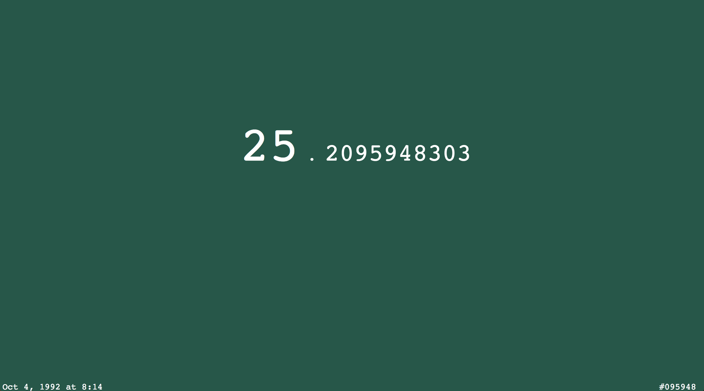
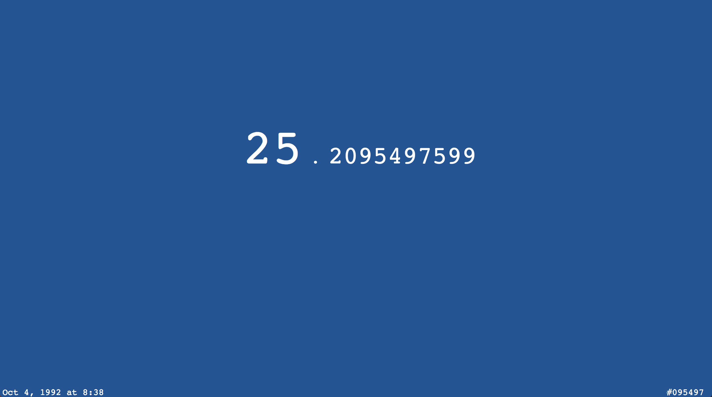
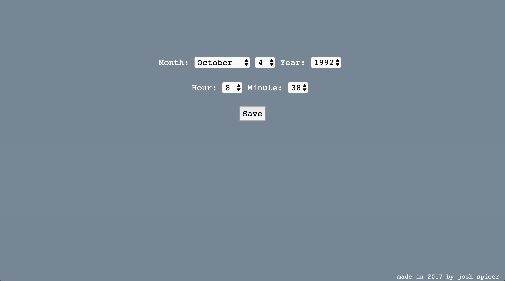

# colorful-motivation

Replaces the (boring and white) new tab page on Chrome with (fun and colorful) motivation.  Displays your current age (down to the second), and generates a background color based on that age.  Click on the birthday in the bottom-left corner to modify current settings.  The hex color is generated from the 2nd through 7th decimal places (the beginning doesn't change much, but the least significant number changes ~5 seconds).  You can see the current hex color being used in the bottom right corner.

Based off of idea put forth in Chrome extension "Motivation" by maccman.  

Find it in the Chrome Web Store here: 
https://chrome.google.com/webstore/detail/colorful-motivation-new-t/mebfadffaiadgfhoieipinanpcmklhil

